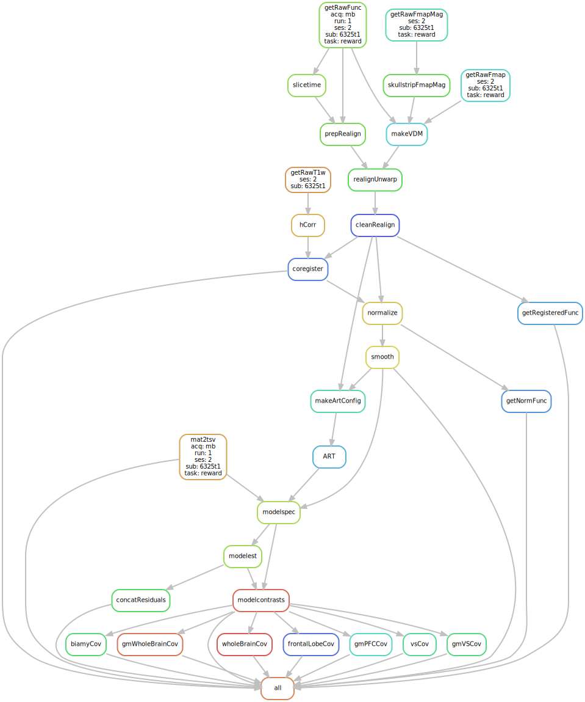

# MiND Lab Standard FMRI processing pipeline

## Introduction

This processing pipeline is based heavily on [Andy's Brain Book](https://andysbrainbook.readthedocs.io/en/latest/SPM/SPM_Overview.html), and is set up to get the data from raw [BIDS](https://bids-specification.readthedocs.io/en/stable/) format to subject specific first level contrast images.

This workflow uses [snakemake](https://snakemake.github.io/) to manage analyses steps through [SPM12](https://www.fil.ion.ucl.ac.uk/spm/software/spm12/) via a [singularity container](https://singularity.hpcng.org/). This allows the workflow to operate seamlessly whether on a high performance computing cluster or via local processing while promoting a higher level of reproducibility and replicability.

This project is still in a beta stage, plenty of updates to come :)



## Required Software

* Singularity 3.7.x
* Python 3.7.x
* Snakemake 5.5.x
* [SPM12 container](https://github.com/UMich-Mind-Lab/singularity-neurotools)
* Matlab 2018a (TODO: remove this by creating run .mat files directly in the container?)
* FSL (TODO: rewrite snakemake steps to do from [neurotools](https://github.com/UMich-Mind-Lab/singularity-neurotools) container)
* Firefox (for [Papaya](http://mangoviewer.com/papaya.html) quality checks)

## Quick Start

```git clone https://github.com/UMich-Mind-Lab/pipeline-task-standard```

1. Update ./config/sm_config.json
  * This file contains BIDS variables, container, data, and library paths used to run the snakemake workflow
2. Update ./config/spm_config.json
  * These are the parameters used when running SPM12 procedures
3. Update ./config/sm_slurm-config.json
  * These are the settings read when running via a SLURM cluster
4. Update ./config/spm_modelcon_config.json
  * This file determines which contrasts get created for each task in SPM12's model contrast function
5. Update snakefile
  * Currently, this file expects the following BIDS variables: sub, ses, task, acq, run. The logic is currently hardcoded to expect those variables, and the snakefile will need to be updated if those variables differ. TODO: use a BIDS-validator to read the dataset and have a script write the snakefile appropriately?

To run locally: ```snakemake [OPTIONS]```

To run via SLURM cluster: See ```./bin/sm_slurm_run.sh``` for an example.


